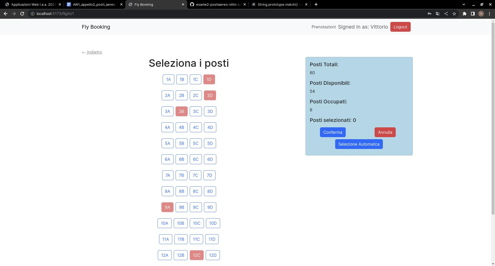

[](https://classroom.github.com/a/_8yXOlwa)

# Exam #2: "Posti Aereo"

## Student: s317408 SANFILIPPO VITTORIO

## React Client Application Routes

- Route `/`: Pagina principale dove verranno visualizzati tutti voli
- Route `/flight/:flightId`: Pagina dove vengono visualizzati i posti, in base se l'utente è autenticato o meno egli potà effettuare una prenotazione o vedere solo lo stato dei posti dell areo ; il parametro viene utilizzaro per recuerare le informazione di quel particolare aereo come il numero di file , i posti per file e i posti momentaneamente occupati.
- Route `/reservations`: Pagina dove l'utente autenticato può vedere le prenotazioni effettuate e decidere in caso di cancellarle.
- Route `/login`: Pagina dove l'utente può autenticarsi.

## API Server

- GET `/api/flights`

  - Request body: _None_

  - Response: `200 OK` (success) or `500 Internal Server Error` (generic error).

  - Response body: Un array di oggetti , ognuno descrive un areo.

    ```
    [ {
        "id": 1,
        "type": "Locale",
        "rows": 15,
        "seats": 4,
        "status":1
    },
    ...
    ]
    ```

- GET `/api/flights/:id`

  - Request body: _None_

  - Request Parameters: id , identificativo di un areo.

  - Response: `200 OK` (success) or `500 Internal Server Error` (generic error) or `404 Not Found`(bad request).

  - Response body: Un oggetto che contiene le file e i posti per fila di un aereo.

    ```
     {

        "rows": 15,
        "seats": 4,

    }


    ```

- GET `/api/bookedSeats/:id`

  - Request body: _None_

  - Request Parameters: id , identificativo di un areo.

  - Response: `200 OK` (success) or `500 Internal Server Error` (generic error) or `404 Not Found`(bad request).

  - Response body: Un array di oggetti, ognuno contenente i posti prenotati su quell'aereo associati a una prenotazione.

    
    ```
    [ {
        "booked": "1A,15D"
    },
    ...
    ]
    ```

- GET `/api/userReservations`

  - Request body: _None_

  - Request Parameters:(credentials : include)

  - Response: `200 OK` (success) or `500 Internal Server Error` (generic error) or `404 Not Found`(bad request) or `401 Unauthorized` (bad request).

  - Response body: Un array di oggetti, ognuno contenente i dati sulle prenotazioni dell'utente autenticato.

    
    ```
    [ {
        "id": 30,
        "id_Ar": 1,
        "date": "2023-07-08",
        "type": "Locale",
        "booked": "1A,15D"
    },
    ...
    ]
    ```

- POST `/api/reservations`

  - Request body: 
    ```
    {
          "id_Ar": 1,
          "date": "2023-07-08",
          "booked": [11A,5B]
      }
    
      ```

  - Request Parameters:(credentials : include)

  - Response: `201 Created` (success) or `500 Internal Server Error` (generic error) or `422 Unprocessable Entity`(bad request) or `401 Unauthorized` (bad request).

  - Response body: Un oggetto contenente l'identificativo della prenotazione inserita.
    ```
      {
            "lastID": 31
            
      }
      
    ```


- DELETE `/api/reservations/:id`

  - Request body: _None_

  - Request Parameters:(credentials : include)

  - Response: `200 OK` (success) or `500 Internal Server Error` (generic error) or `401 Unauthorized` (bad request).

  - Response body: Un oggetto contenente il numero di righe modificate.
    ```
      {
            "changes": 1
            
      }
      
    ```

- POST `/api/session`
  - Request body: _None_

  - Request Parameters: (credentials : include)

  - Response: `200 OK` (success) or `401 Unauthorized` (bad request).

  - Response body: Un oggetto contenente i dati dell'utente.
    ```
      {
            "id": 1,
            "username": "vittorio@test.it"
            "name": "Vittorio"
            
      }
      
    ```
- DELETE `/api/session/current`
  - Request body: _None_

  - Request Parameters: (credentials : include)

  - Response: `200 OK` (success) .

  - Response body: _None_
    
- GET `/api/session/current`
  - Request body: _None_

  - Request Parameters: (credentials : include)

  - Response: `200 OK` (success) or `401 Unauthorized` (bad request).

  - Response body: Un oggetto contenente i dati dell'utente.
    ```
      {
            "id": 1,
            "username": "vittorio@test.it"
            "name": "Vittorio"
            
      }
      
    ```
## Database Tables

- Table `user` - contiene id, email, password, salt, name
- Table `reservation` - contiene id, id_User, date, id_Airplane, booked
- Table `airplane` - contiene id, type, rows, seats, status

## Main React Components

- `Home` (in `Home.jsx`): Mostra tutti i voli e sono disponibili permette di visualizzarne i posti
- `PrenotaPosto` (in `PrenotaPosto.jsx`): Mostra i posti di un determinato aereo. Se l' utente è autenticato permette di selezionare i posti desiderati e di effettuare la prenotazione
- `Reservation` (in `Reservation.jsx`): mostra le prenotazioni effettuate e permette di cancelllarle

(only _main_ components, minor ones may be skipped)

## Screenshot



## Users Credentials

- vittorio@test.it, pwd (utente con le due prenotazioni richieste)
- mario@test.it, pwd (utente senza prenotazioni )
- laura@test.it, pwd (utente con le due prenotazioni richieste)
- francesco@test.it, pwd (utente senza prenotazioni )
